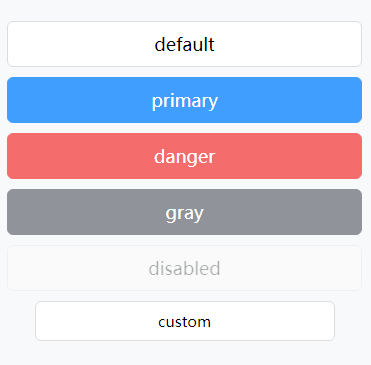

# Button 

用法：

```
<Button type='primary'>default</Button>
```

参数：

1. type： 按钮类型，支持  `primary` 、 `danger` 、`gray` ，可不传 （Sting）
2. onClick： 点击按钮执行的事件。（Function）
3. className： 自定义样式名（String）
4. disabled：是否禁止 (Boolean)

示例：

